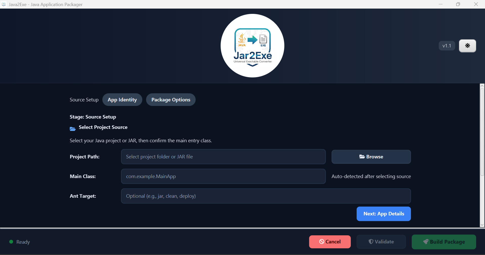
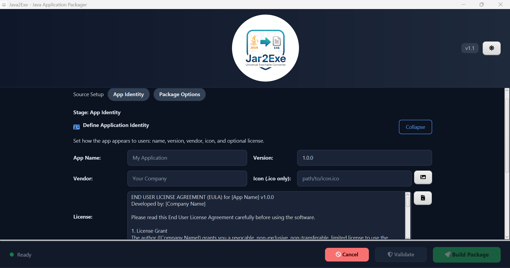
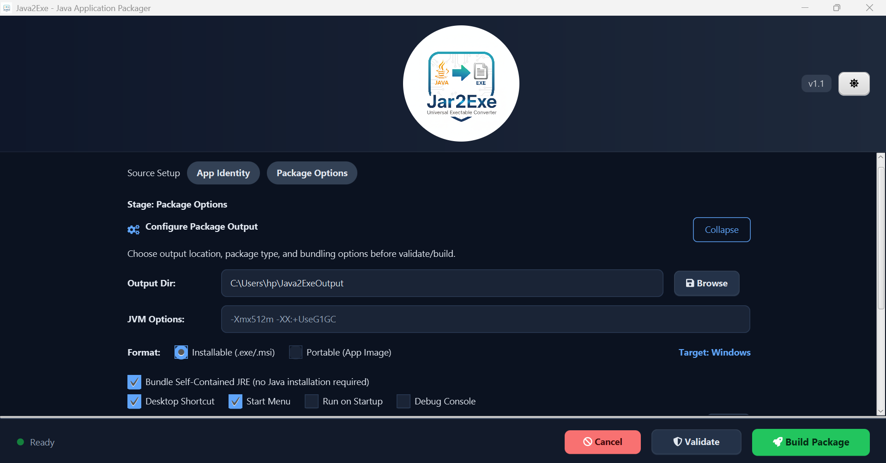

# Jar2Exe - Professional Java Application Packager

**Jar2Exe** is a powerful, user-friendly desktop utility designed to transform Java applications into professional, self-contained Windows executables (`.exe`). By providing a streamlined graphical interface for the JDK's `jpackage` tool, Jar2Exe allows developers to create production-ready installers with embedded JREs, custom icons, and integrated license agreements without the need for complex command-line scripts.

---

## 🚀 Key Features

- **Self-Contained Bundling:** Generate executables that include a private Java Runtime Environment (JRE), ensuring your app runs on any machine without requiring the user to install Java manually.
- **Integrated License Agreements:** Automatically embed EULAs (End User License Agreements) into the `.exe` installation wizard. Users must accept your terms before the software is installed.
- **Intelligent Source Detection:** Automatically detects main classes and project structures from JAR files or Maven project directories.
- **Native Windows Integration:**
  - Custom Application Icons (.ico support).
  - Automatic Desktop Shortcut creation.
  - Start Menu integration.
  - Option to enable/disable the Debug Console for the final executable.
- **Modern JavaFX Interface:** Features a clean, multi-step workflow with a built-in light/dark theme toggle for a superior developer experience.

---

## 🛠 Tech Stack

- **Language:** Java 17+
- **UI Framework:** JavaFX with AtlantaFX (Modern CSS)
- **Build System:** Maven
- **Packaging Engine:** JDK `jpackage`
- **Icons:** Ikonli (FontAwesome integration)

---

## 📋 Prerequisites

Before using Jar2Exe to create Windows installers, ensure your system meets the following requirements:

1.  **JDK 17 or Newer:** The `jpackage` utility must be available in your system's PATH.
2.  **WiX Toolset (v3.11 or later):** **Required** to generate `.exe` and `.msi` installers.
    - [Download WiX Toolset](https://wixtoolset.org/releases/)
    - _Important:_ Add the WiX `bin` folder to your System Environment Variable `PATH`.
3.  **Maven:** For building project-based sources.

---

## 📖 How to Use

### 1. Source Setup

Select your compiled `.jar` file or the root directory of your Maven project. Jar2Exe will attempt to scan and identify the `Main-Class` for you.

### 2. App Identity

Provide your application's professional details:

- **App Name & Version:** How it appears in the Task Manager and Add/Remove Programs.
- **Vendor:** Your company or personal brand name.
- **Icon:** Select a `.ico` file for a professional desktop presence.
- **License:** Paste your EULA text. Jar2Exe will inject this directly into the Windows installer's "Agreement" screen.

### 3. Package Options

Choose your output directory and configure JVM options (like heap size). Select whether you want a portable "App Image" or a full "Installable EXE."

---

## � Screenshots

1. **Source Setup**: This screen allows you to select your compiled `.jar` file or the root directory of your Maven project. Jar2Exe automatically scans and identifies the main class for packaging.

   

2. **App Identity**: Configure your application's professional details here, including the app name, version, vendor, custom icon (.ico), and embed your End User License Agreement (EULA) text.

   

3. **Package Options**: Finalize your packaging settings by choosing the output directory, JVM options (e.g., heap size), and whether to generate a portable App Image or a full installable EXE with installer wizard.

   

---

## �🔨 Getting Started

To build Jar2Exe itself:

```bash
git clone https://github.com/your-repo/Jar2Exe.git
cd Jar2Exe
mvn clean package
```

Run the application using your IDE or:

```bash
java -jar target/java2exe-1.0.0.jar
```

---

## 📝 Notes & Troubleshooting

- **WiX Errors:** If the build fails with "light.exe" or "candle.exe" errors, verify that the WiX Toolset is correctly installed and accessible from your terminal.
- **Icons:** For best results on Windows, always use a high-resolution `.ico` file.

## 📄 License

This project is provided for development purposes. Please ensure your own generated applications comply with the licenses of the libraries they include.
